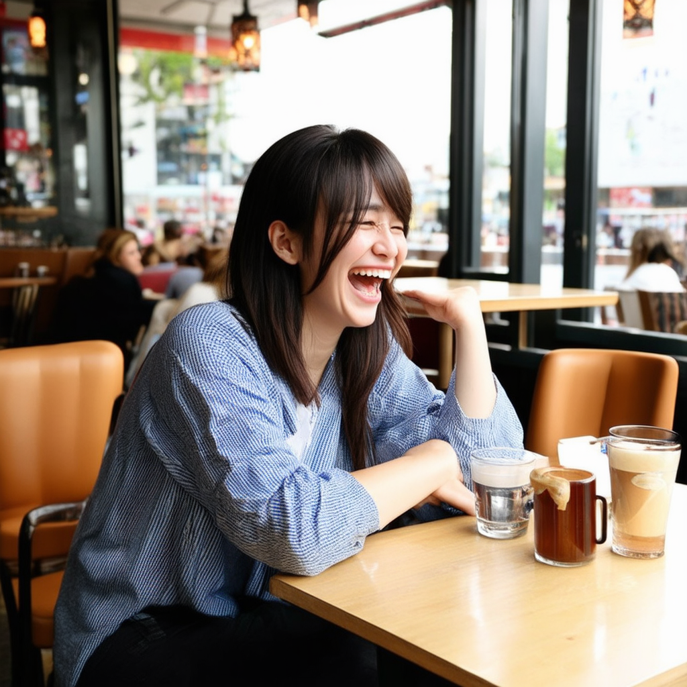
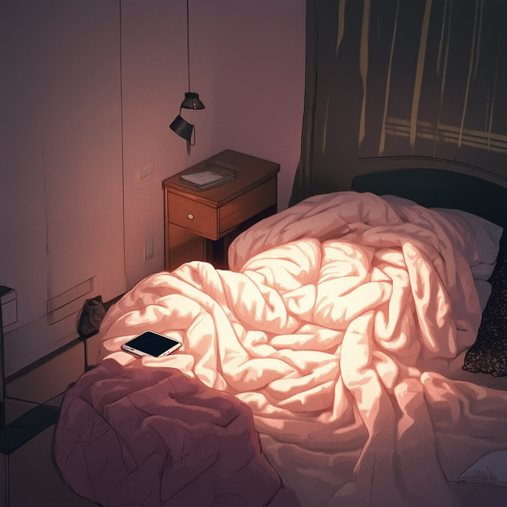

# Lora on Stable Diffusion 3 Medium

In this project we perform Lora over stability-AI's Stable Diffusion 3 Medium Model. We perform lora over the Uneyoki art style. Trained the sd3 model over 40 images from the art style with the instance prompt of "in the uneyoki art style". Used the BLIP model to caption the images initially and manually rectified the captions if they were misleading.
Produced outputs on 3 unseen prompts.
Prompts:
1) A candid portrait of a 25-year-old laughing in a café, natural light
2) A gym selfie with sneakers on the floor and a water bottle nearby
3) A cozy bedroom with a messy blanket and phone glowing on the nightstand

We performed lora using the diffusers library. Changed the source code of the compute_embeddings.py and training script to allow the library to dynamically train model and images and their respective captions stores in txt files with the exact same name.

| Base Model (Before) | LoRA Model (After) |
|:-------------------:|:------------------:|
| *Prompt: “A candid portrait of a 25-year-old laughing in a café, natural light”* |
|  |  |
| *Prompt: “A gym selfie with sneakers on the floor and a water bottle nearby”* |
|  |  |
| *Prompt: “A cozy bedroom with a messy blanket and phone glowing on the nightstand”* |
|  |  |

Steps:
1) Clone the Repository
2) Run till the cell downloading diffusers library
3) navigate to diffusers->examples->research_projects->sd_lora_3_colab
4) Create dataset folder and add images along with captions in same named txt files
5) Replace the compute_embedding.py and train_dreambooth_lora_sd3_miniature.py with the ones give in the repository
6) Save them
7) Run the remaining cells
